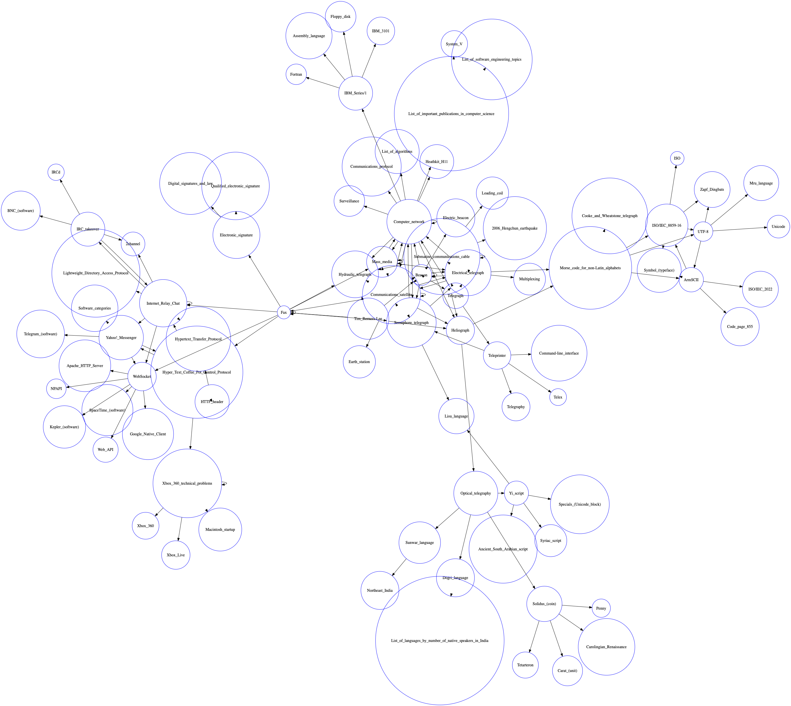

# Simple Wikipedia Visualizer

## Starting

To get started, please ensure you have python3 and pip3 installed.

a. Clone this repository:
```zsh
git clone https://github.com/michaelstresing/wiki_viz
```
b. Enter the repo:
```zsh
cd wiki_viz
```
c. Install the requirements:
```zsh
pip3 install -r requirements.txt
```

## CLI

| Argument      | CLI Symbol  | Default |
| ------------- |:-----------:| :-------: |
| URL           | --url       | https://en.wikipedia.org/wiki/Kraftwerk |
| Width (# of links scraped /page)      | --w (or) --width | 3 |
| Depth (# of steps away from url)      | --d (or) --depth | 4 |

For example:

```zsh
python3 main.py --url https://en.wikipedia.org/wiki/Sade_(singer) --d 4 --w 5
```

## Example Output

Here is a sample output of the graph starting on Tim Berners-Lee's page, scraping 4 links per page, 3 layers deep. 



## (Alternative) Using NX graphs instead

Please note, for an alternative rendering of the vizualisation, using nx/matplotlib, please run:

```zsh
 export WIKI_CRAWL_OUTPUT="nx"
```
Then use as normal. 